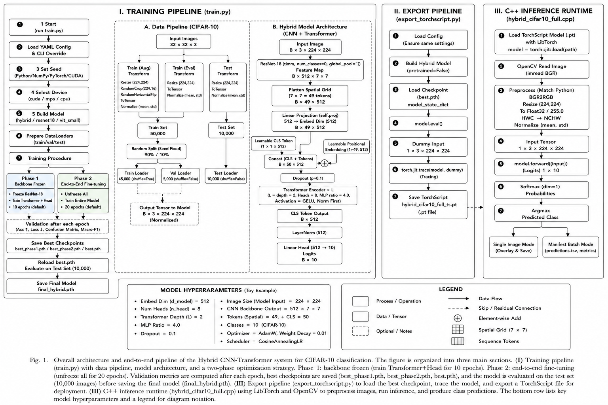
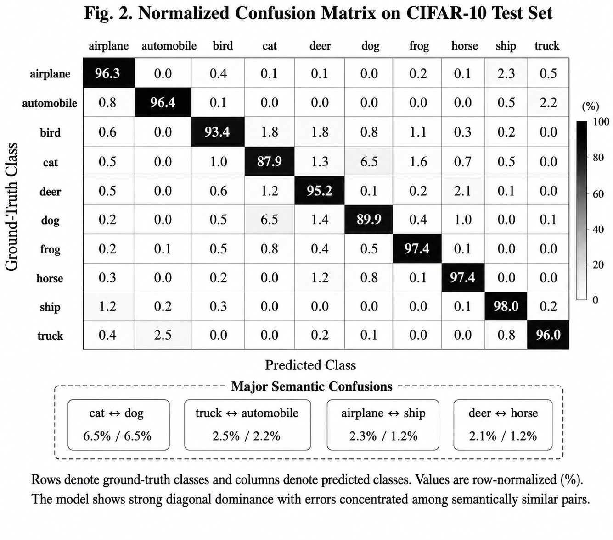
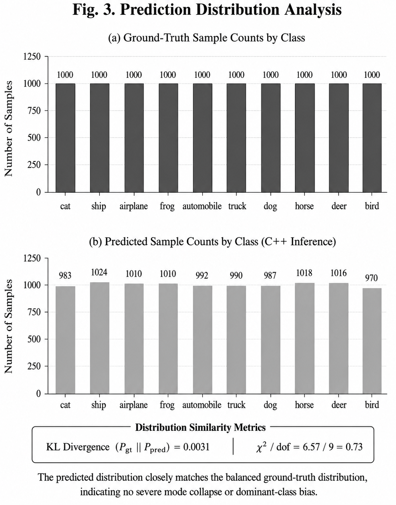
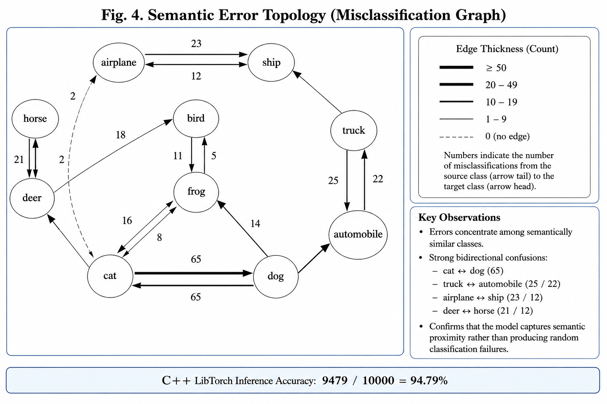
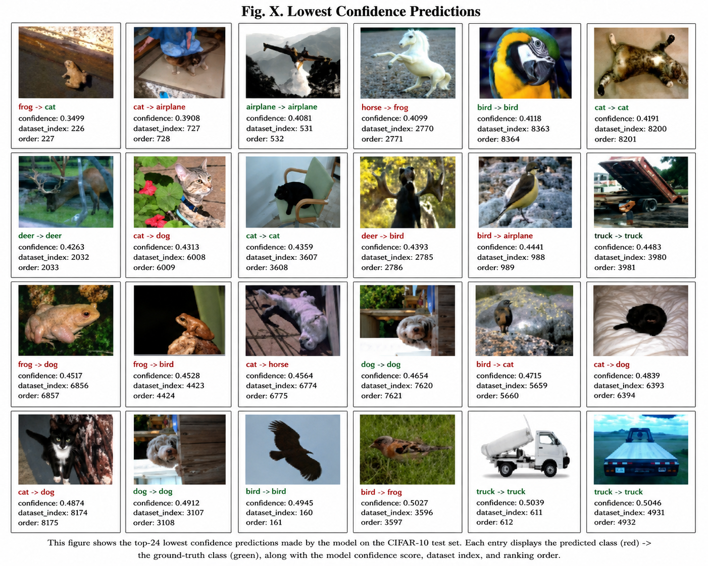
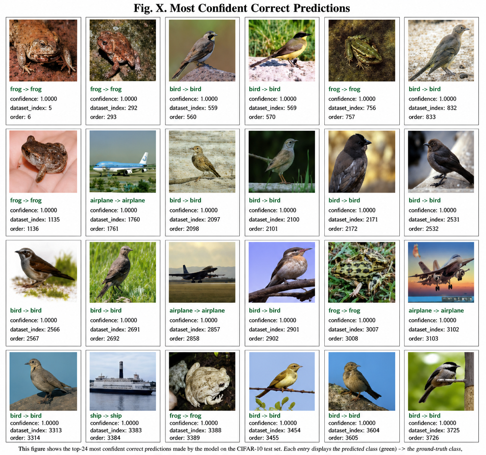
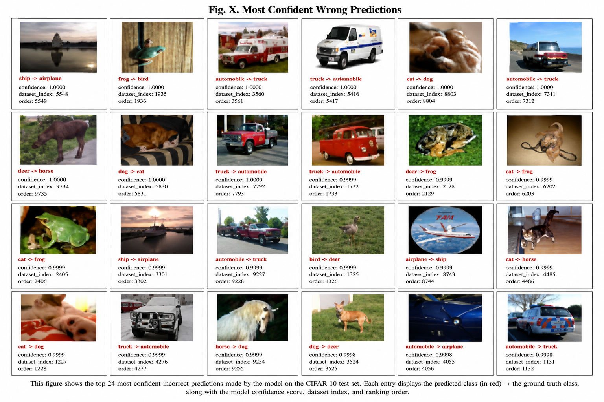

# CNN-Transformer Hybrid for CIFAR-10

This project implements a reproducible CIFAR-10 image classification pipeline with:

- Python training / validation / test
- ResNet-18 + Transformer Encoder hybrid model
- Baseline comparison models
- TorchScript export for assignment-oriented C++ inference
- LibTorch + OpenCV single-image inference

The goal is to make baseline comparison straightforward. Any accuracy or latency claims should be validated by running experiments in your environment.

## Project Structure

```text
cnn_transformer_cifar10/
├── .gitignore
├── README.md
├── FULL_TRAIN_CPP_GUIDE.md
├── requirements.txt
├── configs/
│   ├── cifar10_hybrid_full.yaml
│   └── cifar10_hybrid_smoke.yaml
├── cpp_infer/
│   ├── CMakeLists.txt
│   └── main.cpp
├── data/
│   └── cifar_10/
├── prediction_results/
│   ├── README.md
│   └── visualize_predictions.py
├── python/
│   ├── build_contact_sheet.py
│   ├── evaluate_checkpoint.py
│   ├── export_cifar10_class_subset.py
│   ├── export_torchscript.py
│   ├── train.py
│   ├── models/
│   │   ├── __init__.py
│   │   ├── baselines.py
│   │   └── hybrid.py
│   └── utils/
│       ├── __init__.py
│       ├── data.py
│       ├── metrics.py
│       └── seed.py
├── runs/
│   └── dgx_spark_full_cpp/
├── samples/
└── scripts/
    └── dgx_spark_full_cpp_pipeline.sh
```

## Dataset Facts
## Final Evaluation Summary

| Metric | Result |
|---|---:|
| Best Validation Accuracy (Phase 2) | 95.46% |
| Python Test Accuracy | 94.89% |
| C++ LibTorch Inference Accuracy | 94.79% |
| Correct Predictions | 9479 / 10000 |
| Test Dataset Size | 10000 |
| Classes | 10 |
| Input Resolution | 224 × 224 |
| Backbone | ResNet-18 |
| Transformer Tokens | 49 + CLS |

- CIFAR-10 contains 60,000 color images.
- The original image size is `32x32`, not `224x224`.
- It contains 10 classes, with 50,000 training images and 10,000 test images.
- This project resizes images to `224x224` so a ResNet-18 backbone can produce a `7x7` feature map, which becomes `49` spatial tokens for the Transformer encoder.

## Architecture



*Fig.1. Overall architecture and end-to-end pipeline of the Hybrid CNN-Transformer system for CIFAR-10 classification.*


```text
Python Training / Model Definition
  CIFAR-10 Image (32x32)
    -> Resize to 224x224 + Normalize
    -> ResNet-18 Backbone
       output: B x 512 x 7 x 7
    -> Flatten Spatial Grid
       B x 512 x 7 x 7 -> B x 49 x 512
    -> Linear Projection
       B x 49 x 512 -> B x 49 x D
    -> CLS Token + Positional Embedding
       B x 49 x D -> B x 50 x D
    -> Transformer Encoder
    -> Classification Head
    -> 10-class logits
    -> best.pth

TorchScript Export
  best.pth
    -> rebuild hybrid model
    -> load model_state_dict
    -> torch.jit.trace(...)
    -> hybrid_cifar10_full_ts.pt

C++ Inference Runtime
  image_path or manifest.tsv
    -> OpenCV imread
    -> BGR to RGB
    -> Resize to 224x224
    -> Float scaling + Normalize
    -> NCHW tensor
    -> load hybrid_cifar10_full_ts.pt with LibTorch
    -> model.forward(...)
    -> softmax -> prediction/confidence
    -> annotated image or predictions.tsv + confusion matrix
```

Code locations for each stage:

- `Python resize / normalize / dataloading`: [python/utils/data.py](/home/jiwoo/Desktop/workspace/cnn_transformer_cifar10/python/utils/data.py)
- `Hybrid model definition`: [python/models/hybrid.py](/home/jiwoo/Desktop/workspace/cnn_transformer_cifar10/python/models/hybrid.py)
- `Training / checkpoint save`: [python/train.py](/home/jiwoo/Desktop/workspace/cnn_transformer_cifar10/python/train.py)
- `TorchScript export (.pth -> .pt)`: [python/export_torchscript.py](/home/jiwoo/Desktop/workspace/cnn_transformer_cifar10/python/export_torchscript.py)
- `C++ preprocess / LibTorch forward / batch output`: [cpp_infer/main.cpp](/home/jiwoo/Desktop/workspace/cnn_transformer_cifar10/cpp_infer/main.cpp)

## Installation

### macOS / Linux

```bash
python -m venv .venv
source .venv/bin/activate
pip install -r requirements.txt
```

For the full Linux/DGX Spark workflow covering end-to-end training and C++ batch inference on the CIFAR-10 test set, see `FULL_TRAIN_CPP_GUIDE.md`.

### Windows PowerShell

```powershell
python -m venv .venv
.venv\Scripts\Activate.ps1
pip install -r requirements.txt
```

## Training

The training entrypoint supports the hybrid model and two baselines:

- `hybrid`
- `resnet18`
- `vit_small`

### Recommended smoke training

```bash
python python/train.py \
  --config configs/cifar10_hybrid_smoke.yaml \
  --model hybrid \
  --device cpu \
  --output-dir runs/smoke_test
```

### Hybrid training phases

The hybrid model uses two phases:

1. Phase 1: freeze the CNN backbone and train the Transformer / head.
2. Phase 2: unfreeze the full network and fine-tune end-to-end.

Logs follow this style:

```text
[phase1] epoch=001 train_loss=... train_acc=... val_loss=... val_acc=...
[phase2] epoch=001 train_loss=... train_acc=... val_loss=... val_acc=...
[TEST] loss=... acc=...
```

## TorchScript Export

```bash
python python/export_torchscript.py \
  --config configs/cifar10_hybrid_smoke.yaml \
  --checkpoint runs/smoke_test/best.pth \
  --output hybrid_cifar10_smoke_ts.pt
```

## C++ Build And Inference

### macOS / Linux

```bash
TORCH_CMAKE_PREFIX_PATH="$(python -c 'import torch; print(torch.utils.cmake_prefix_path)')"
cmake -S cpp_infer -B build -DCMAKE_PREFIX_PATH="${TORCH_CMAKE_PREFIX_PATH}"
cmake --build build --config Release
```

### Windows PowerShell

```powershell
$env:TORCH_CMAKE_PREFIX_PATH = python -c "import torch; print(torch.utils.cmake_prefix_path)"
cmake -S cpp_infer -B build -DCMAKE_PREFIX_PATH=$env:TORCH_CMAKE_PREFIX_PATH
cmake --build build --config Release
```

The C++ binary supports two modes:

- single-image inference
- manifest-based batch inference

### Single-Image Mode

```text
cifar10_infer <model.pt> <image_path> [output_image_path]
```

You can use either:

- an existing CIFAR-10 image inside `data/cifar_10/...`
- your own image placed in `samples/`

Examples:

```bash
./build/cifar10_infer ./hybrid_cifar10_smoke_ts.pt ./data/cifar_10/test/cat/0071.jpg
./build/cifar10_infer ./hybrid_cifar10_smoke_ts.pt ./samples/dog1.jpg
./build/cifar10_infer ./hybrid_cifar10_smoke_ts.pt ./samples/dog1.jpg ./outputs/dog1_prediction.jpg
```

If `output_image_path` is omitted, the program saves an annotated result image to `outputs/<input_stem>_prediction.jpg`.

### Batch Mode With `manifest.tsv`

```text
cifar10_infer <model.pt> <manifest.tsv> [predictions.tsv]
```

In batch mode, the program reads `manifest.tsv`, loads each listed PNG image, runs inference, writes one row per sample to `predictions.tsv`, and prints the confusion matrix to stdout.

Example:

```bash
./build_dgx_spark/cifar10_infer \
  runs/dgx_spark_full_cpp/hybrid_cifar10_full_ts.pt \
  runs/dgx_spark_full_cpp/cpp_full_test/inputs/manifest.tsv \
  runs/dgx_spark_full_cpp/cpp_full_test/predictions.tsv | \
  tee runs/dgx_spark_full_cpp/cpp_full_test/cpp_infer.log
```

This mode is what the full CIFAR-10 C++ evaluation uses. The main outputs are:

- `runs/dgx_spark_full_cpp/cpp_full_test/inputs/manifest.tsv`
- `runs/dgx_spark_full_cpp/cpp_full_test/predictions.tsv`
- `runs/dgx_spark_full_cpp/cpp_full_test/cpp_infer.log`

## Full Run Artifacts

When you run the full Linux/DGX Spark pipeline, the main outputs are written under `runs/dgx_spark_full_cpp`.

### `manifest.tsv`

`manifest.tsv` is the batch input manifest used by the C++ inference binary. It tells the program which exported PNG image to read and what the expected CIFAR-10 label is for that image.

Each row contains:

- `order`: sample order in the batch run
- `dataset_index`: original CIFAR-10 test set index
- `target_idx`: ground-truth class index
- `target_name`: ground-truth class name
- `file_name`: exported PNG file name inside `cpp_full_test/inputs`

In practice, `manifest.tsv` is the lookup table that connects the exported test PNG files to their original dataset indices and labels. The C++ batch runner reads this file first, then writes matching predictions to `predictions.tsv`.

Example row:

```tsv
1	0	3	cat	00000_cat.png
```

Interpretation of this row:

- `order=1`: this is the first sample in the batch manifest
- `dataset_index=0`: it corresponds to CIFAR-10 test sample index `0`
- `target_idx=3`, `target_name=cat`: the ground-truth label is `cat`
- `file_name=00000_cat.png`: the C++ program should load `runs/dgx_spark_full_cpp/cpp_full_test/inputs/00000_cat.png`

### Confusion Matrix Analysis



*Fig.2. normalized confusion matrix on the CIFAR-10 test set.*



*Fig.3. Ground-truth and predicted class distribution comparison for the full C++ inference evaluation.*



*Fig.4. Semantic misclassification topology derived from the CIFAR-10 inference results.*

`predictions.tsv` is the batch inference result file written by the C++ inference binary for all 10,000 CIFAR-10 test images.

Each row contains:

- `order`: sample order from the manifest
- `dataset_index`: original CIFAR-10 test set index
- `target_idx`: ground-truth class index
- `target_name`: ground-truth class name
- `pred_idx`: predicted class index
- `pred_name`: predicted class name
- `confidence`: predicted softmax probability
- `correct`: `1` if the prediction is correct, otherwise `0`
- `image_path`: path to the PNG image used for inference

In practice, `predictions.tsv` is an image-level prediction table containing the ground truth, predicted label, confidence score, and correctness flag for every exported test image. It is enough to recompute overall accuracy, inspect errors, and rebuild a confusion matrix.

Example row:

```tsv
1	0	3	cat	3	cat	0.999943	1	runs/dgx_spark_full_cpp/cpp_full_test/inputs/00000_cat.png
```

Interpretation of this row:

- `order=1`: this is the first sample in the manifest-driven batch run
- `dataset_index=0`: it comes from CIFAR-10 test sample index `0`
- `target_idx=3`, `target_name=cat`: the ground-truth label is `cat`
- `pred_idx=3`, `pred_name=cat`: the model also predicted `cat`
- `confidence=0.999943`: the model assigned about `99.9943%` probability to that prediction
- `correct=1`: the prediction was correct
- `image_path=.../00000_cat.png`: the inference input image was the exported PNG file at that path

### Files Under `runs/dgx_spark_full_cpp`

- `best.pth`: primary checkpoint selected by validation performance. This is the default checkpoint used for evaluation and TorchScript export.
- `best_phase1.pth`: best checkpoint from phase 1 training, where the CNN backbone is frozen.
- `best_phase2.pth`: best checkpoint from phase 2 fine-tuning, where the full model is trained end to end.
- `final_hybrid.pth`: model weights from the final epoch. This is not guaranteed to be the best-performing checkpoint.
- `train.log`: training log file with epoch-level train and validation metrics.
- `eval.log`: test-set evaluation log for `best.pth`, including metrics such as loss, accuracy, macro F1, and the confusion matrix.
- `hybrid_cifar10_full_ts.pt`: TorchScript model file used by the LibTorch C++ inference binary.

### Files Under `runs/dgx_spark_full_cpp/cpp_full_test`

- `inputs/manifest.tsv`: manifest listing the exported test images and their targets for batch inference.
- `inputs/*.png`: exported CIFAR-10 test images used as the actual C++ batch inference inputs.
- `predictions.tsv`: tab-separated batch inference output for all exported test images.
- `cpp_infer.log`: console log from the C++ batch inference run, typically including summary values such as `samples=...`, `correct=...`, and `accuracy=...`.

## TorchScript Note

TorchScript is deprecated in recent PyTorch documentation. It is used here only to support a simple LibTorch-based assignment inference path. For long-term deployment, evaluate `torch.export` or ONNX depending on runtime needs.

## Smoke Test / Verification

Syntax-only verification:

```bash
python -m compileall python
```

```bash
python python/train.py --config configs/cifar10_hybrid_smoke.yaml --model hybrid --device cpu --output-dir runs/smoke_test
```

## Qualitative Prediction Analysis

### Lowest Confidence Predictions



*Fig.5. Lowest-confidence predictions on the CIFAR-10 test set. These samples typically contain ambiguous visual structure, motion blur, unusual viewpoints, partial occlusion, or semantic overlap between classes.*

---

### Most Confident Correct Predictions



*Fig.6. Most confident correct predictions produced by the Hybrid CNN-Transformer model. These samples exhibit strong class-specific semantic features and clear visual separability.*

---

### Most Confident Wrong Predictions



*Fig.7. Most confident incorrect predictions on the CIFAR-10 test set. These examples reveal semantically similar class pairs where the model produces highly confident but incorrect decisions.*

## References

1. Krizhevsky, A. "CIFAR-10 Dataset."
2. He, K., Zhang, X., Ren, S., and Sun, J.
   "Deep Residual Learning for Image Recognition."
   CVPR 2016.
   
3. Dosovitskiy, A. et al.
   "An Image is Worth 16x16 Words:
   Transformers for Image Recognition at Scale."
   ICLR 2021.

4. Vaswani, A. et al.
   "Attention Is All You Need."
   NeurIPS 2017.

5. PyTorch Documentation:
   TorchScript, torch.export, LibTorch.